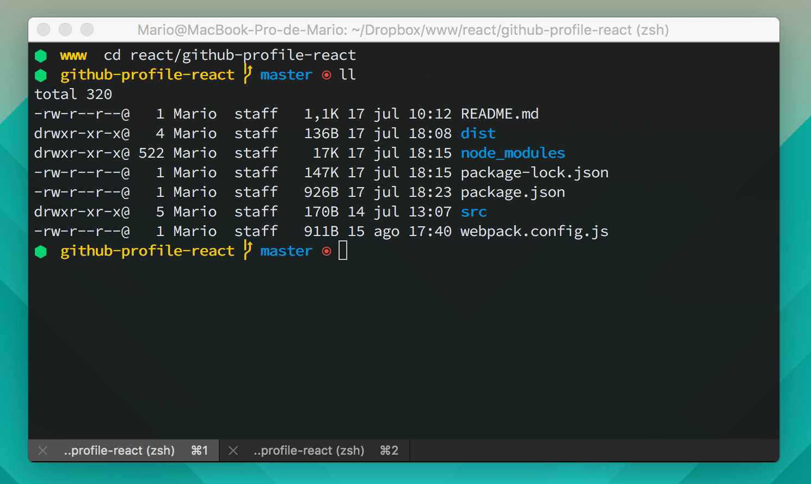

### iTerm2
**iTerm2** is a replacement for Terminal and the successor to iTerm. It works on Macs with OS 10.5 (Leopard) or newer. iTerm2 brings the terminal into the modern age with features you never knew you always wanted.

* [iTerm2](https://www.iterm2.com/)
* Theme: [Brogrammer](https://github.com/mbadolato/iTerm2-Color-Schemes)
* Font: [Hasklig](https://github.com/i-tu/Hasklig/)

### Oh My Zsh
**Oh-My-Zsh** is an open source, community-driven framework for managing your ZSH configuration. 

It comes bundled with a ton of helpful functions, helpers, plugins, themes, and a few things that make you shout...

* [Oh-My-Zsh](ohmyz.sh)
* Theme: [Node](https://github.com/skuridin/oh-my-zsh-node-theme)
* Plugins:
  * git
  * history
  * node
  * osx
* Aliases:
  * mkcd